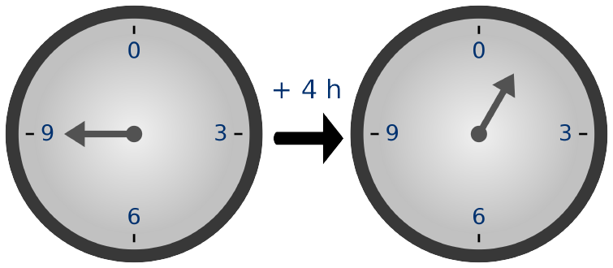

*Special thanks to Matthew Ryan for review and feedback.*

We have so far explored some [interesting applications]() enabled by SNARKs and the theory that precluded it all (i.e., [interactive proof systems]()). This is the article where we finally get to formally define SNARKs 🎉🥳! The goal of this piece is threefold:
1. To introduce the background (i.e., mathematical and computational) knowledge needed to give you a solid base to understand SNARKs holistically.
2. To formally define SNARKs using the definitions above.
3. To introduce a general approach for building modern SNARKs systems.

This post is heavily inspired on this [lecture](https://www.youtube.com/watch?v=bGEXYpt3sj0) by Dan Boneh. Following the same order and structure, here I put together my notes of the concepts skilfully explained by him with some of my own research to provide context and reference to such complex topics. 

We will now begin by tackling the first goal of this article; In order to fully appreciate and understand how SNARKs work, we need to understand some mathematical definitions and its model of computation.

# Background knowledge
When I was learning about SNARKs on my own, I regret spending too much time diving too deep into field theory and FFTs instead of jumping earlier into the core of the technology. In my experience, it is not really necessary that you understand every mathematical concept in a God level before you can start understanding SNARKs, so I summarized the important parts below. While the definitions here are not exactly 100% mathematically accurate, they will give you enough foundation to move on.

## Modular arithmetic
Modular arithmetic is a system of arithmetic for numbers that "wrap around" after reaching a certain value called the modulus. It's often referred to as [clock arithmetic](http://math.ucdenver.edu/~wcherowi/clockar.html) because of its similarity to the way hours "wrap around" on a clock. Quoting this [Wikipedia article](https://en.wikipedia.org/wiki/Modular_arithmetic):
>A familiar use of modular arithmetic is in the 12-hour clock, in which the day is divided into two 12-hour periods. If the time is 7:00 now, then 8 hours later it will be 3:00. Simple addition would result in 7 + 8 = 15, but 15:00 reads as 3:00 on the clock face because clocks "wrap around" every 12 hours and the hour number starts over at zero when it reaches 12. We say that 15 is congruent to 3 modulo 12, written 15 ≡ 3 (mod 12), so that 7 + 8 ≡ 3 (mod 12). Similarly, 8:00 represents a period of 8 hours, and twice this would give 16:00, which reads as 4:00 on the clock face, written as 2 × 8 ≡ 4 (mod 12).

Time-keeping on this clock uses arithmetic modulo 12. Adding 4 hours to 9 o'clock gives 1 o'clock, since 13 is congruent to 1 modulo 12.

If you understand the following you probably have everything you need to move on: 
$$
5 \mod 2 = 1
\\\
3\equiv (5 \mod 2)
\\\
-3\equiv (7 \mod 2)
$$


## Finite fields
A finite field, also known as Galois field (named after the mathematician Évariste Galois), is an algebraic structure with a finite number of elements. In practice, you can think of a finite field as the set of integers modulo \\(p\\), where \\(p\\) is some very large prime number. Here's the definition:

$$
\mathbb{F}_p = \\{0, 1, ..., p-1\\}, \\ p > 2
$$

As long as we satisfy some basic rules, we can add, subtract, multiply, and divide the elements of \\( \mathbb{F}_p \\). The set of *integers modulo \\(p\\)* is a common example of a finite field. Be sure to understand it, we are going to use these finite fields everywhere in SNARKs! If you want to learn more about them, watch ["Finite Fields in Cryptography: Why and How"](https://youtu.be/ColSUxhpn6A) and [this funny video by Numberphile](https://youtu.be/FCczHiXPVcA).

## Polynomials
Polynomials are mathematical objects which can be represented in multiple ways. They can be either univariate or multivariate, I will focus on the former. A (univariate) polynomial \\( A \\) in \\( x \\) over a field \\( \mathbb{F}_p \\) is defined as:

$$
A(x) = \sum_{j=0}^{n-1} a_jx^j
$$

If we expand the formula above for \\( n=3 \\), we get its equivalent:
$$
A(x) = a_0x^0 + a_1x^1 + a_2x^2 = a_0 + a_1x + a_2x^2
$$

The values \\(a_0, a_1, ...,a_{n-1}\\) are called coefficients. A single non-zero coefficient and its power of x (e.g. \\(a_2 x^2\\)) is known as a monomial. The *polynomial degree* is defined by the highest monomial degree. The parameter \\(n\\) defines the *order* (aka degree-bound) of the polynomial, it is equal to the number of coefficients in the expression. The order is strictly larger than the polynomial degree \\(k\\), so you can always assume \\(n \geq k+1\\). In the example above, the order of \\(A(x)\\) is 3 and its degree is 2. 

# Arithmetic circuits:
In order for our SNARK construction to be able to build proofs of computation we have to fix the [computation model]() it will operate upon. The model we will use here is called ["arithmetic circuits"](https://en.wikipedia.org/wiki/Arithmetic_circuit_complexity). These circuits are the algebraic analog of boolean circuits. An arithmetic circuit \\(C\\) over a field \\(\mathbb{F}_p\\) is a function that uses field operations \\( \\{+, -, \times \\}\\) on \\(n\\) elements to produce a final element in the same field as output.

$$
C: \mathbb{F}_p^n \rightarrow \mathbb{F}_p
$$

Do you see the resemblance with the definition of polynomials? In fact, such circuits are the standard computation model used to compute n-variate polynomials! Let's see how they work with an example:  


Arithmetic circuits are layered as [DAGs](https://en.wikipedia.org/wiki/Directed_acyclic_graph) (directed graphs with no cycles). The inputs are the leaves \\( \\{x1, x2, x3, 1 \\} \\). The gates are the internal nodes \\( \\{+, -, \times \\}\\). The circuit outcome computes the function in blue, an n-variate polynomial in \\( \\{x1, x2, x3\\} \\). You can think of the arithmetic circuits representation as a step-by-step recipe for evaluating the polynomial they represent.

**Some important notation before we continue:** |C| defines the number of gates in a circuit C. In the image above |C| = 4.

## Examples of arithmetic circuits
Arithmetic circuits are machines that compute n-variant polynomials, so they can do anything that polynomial time computations can do! There exist many interesting circuits available, let's look at a simple one:

```
C_SHA256(h, m) = (h - SHA256(m))
```

`C_SHA256` is the circuit that can validate if someone knows the hash `h` of a message `m`. The inputs `h` and `m` are given. `C_SHA256` outputs `0` if the `SHA256` hash of the message `m` is equal to `h` and not zero otherwise. `C_SHA256` can be entirely implemented (including `SHA256`) with about 20k gates (simple addition, subtraction, and multiplication field operations), isn't that amazing? `C_SHA256` is considered a small arithmetic circuit.

We can actually build circuits that do much more complicated things. You can see some examples of these in my last post about SNARKs [applications](). Maybe this conclusion slipped unnoticed, but did you realize that we can use circuits to represent computations of programs as well? Think about it using the example above. This conclusion is very important. We will make heavy use of it later on when we dig into SNARKs constructions. For now, let me introduce the two types of circuits most often used today.

## Types of circuits
Circuits are often categorized in one of the two following categories:
* **Unstructured circuits**: In these circuits, the wires can be connected in any way the developer wants. It's like having a bunch of gates, and you can connect them however you like.
* **Structured circuits**: These circuits are layered in a very organized way. Imagine there's one special arithmetic circuit design, and you just keep using the same design over and over again in a neat, repetitive pattern. A very famous category of structured circuits are called virtual machine (or VM, this is where the zkVM term comes from). In a zkVM, the same fixed circuit is repeated over and over again until the computation is finished. You can think of the fixed circuit as being the same microprocessor that gets called to execute a step in the instruction cycle to continue the computation of a program until it finishes running.

# SNARKs
Now that we have enough foundation knowledge, let's start applying it to SNARKs! A SNARK is always applied to a general public arithmetic circuit \\(C\\) as follows:
$$
C(x, w) \rightarrow \mathbb{F}_p
$$

The circuit \\(C\\) takes two parameters as input:
* **\\(x\\)** is the public statement in \\(\mathbb{F}_p^n\\), where \\(n\\) is the number of elements in the field and \\(p\\) the size of the field.
* **\\(w\\)** is the secret witness in \\(\mathbb{F}_p^m\\), where \\(m\\) is the number of elements in the field and \\(p\\) the size of the field.

Because \\(C\\) is an arithmetic circuit, it will also output an element in the finite field \\(\mathbb{F}_p\\) as the result of the computation.

A SNARK is made up of three algorithms: \\(S,P,V\\)

\\(S\\) is the pre-processing (or setup) algorithm that takes a description of the circuit and outputs two public parameters (sometimes also called prover key \\(pk\\) and verifier key \\(vk\\)). Let's take a better look into \\(S\\):
$$
S(C) \rightarrow (pp, vp)
$$

The public parameter \\(pp\\) is used by the Prover and \\(vp\\) by the Verifier.

\\(P\\) is the Prover's algorithm. It takes as inputs \\((pp, x, w)\\) and outputs the proof \\(\pi\\). It has the goal of proving (using \\(\pi\\)) that it **knows** a secret witness \\(w\\) for a given a public circuit \\(C\\) and public statement \\(x\\), or simply \\(C(x, w) = 0\\). In the `C_SHA256` circuit above, \\(P\\) would create a short proof \\(\pi\\) to prove that it knows a message `m` that hashes to `h` (i.e., that `m` is the `SHA256` pre-image of `h`). Here's how \\(P\\) looks like:

$$
P(pp, x, w) \rightarrow \pi, \quad\text{where len}(\pi) = O_\lambda(\text{sublinear}(|w|))
$$

For it to be considered part of a SNARK system, \\(P\\) must output a succinct proof \\(\pi\\). The succinctness property comes from the requirement that the length of \\(\pi\\) must be sublinear in the length of the secret witness \\(w\\). To illustrate this using the `C_SHA256` example, the length of the proof \\(\pi\\) isn't allowed to be of the same length of the message `m`, it has to be sublinear in it. Sublinear functions grow slower than any existing linear function. You may consider \\(f(x) = \sqrt x\\) as a sublinear function.

\\(V\\) is the Verifier's algorithm. It takes as inputs \\((vp, x)\\). The role of \\(V\\) is to accept or reject the the proof \\(\pi\\) after it quickly verifies it. So, we have:
$$
V(vp, x) \rightarrow \\{1, 0\\}, \quad\text{where time}(V) = O_\lambda(|x|, \text{ sublinear}(|C|))
$$

Also for \\(V\\) to be considered part of a SNARK system, it has to full fill the runtime requirement above. To prevent \\(V\\) from simply running the circuit \\(C\\) all over again, its runtime is required to be sublinear in the length of \\(C\\). In order to know what statement it is verifying, \\(V\\) has to read the input \\(x\\), so we allow its runtime to be linear in the length of \\(x\\).

The definition above requires sublinear complexity of \\(P\\) and \\(V\\). In practice we want to be more efficient and strict, so we pin down a clear requirement for that sublinear behavior. So we constrain both actors to behave under a logarithmic function in the size of the circuit. Therefore, in practice we get:
$$
P(pp, x, w) \rightarrow \pi, \quad\text{where len}(\pi) = O_\lambda(\log(|C|))
\newline \\
V(vp, x) \rightarrow \\{1, 0\\}, \quad\text{where time}(V) = O_\lambda(|x|, \log(|C|))
$$

Notice here that \\(V\\) doesn't even have enough time to read the entire circuit \\(C\\) before it runs out of time to accept or reject the proof. The insight here is that this is unlocked by the use of the \\(vp\\) public parameter, it represents a (at most) log sized "summary" of \\(C\\). Surprisingly, some SNARK systems have constant time complexity in \\(|C|\\). In such systems, \\(V\\) we always take the same constant amount of time to verify any circuit, being it the simplest or the most complex circuit you can think of (the same is true for \\(P\\) and its proof length) 🤯 🤯 🤯 ... This is why the setup step is so crucial in a SNARK, so we will look into it in more detail next.

## Setup
The setup step normally takes one extra input \\(r\\) together with the circuit \\(C\\). It uses \\(r\\) random bits to generate the public parameters \\(pp\\) and \\(vp\\). Therefore, let's updated notation, it now is \\(S(C;r) \rightarrow (pp, vp)\\).

There are three different setups:
1. **Trusted setup per circuit**: for every circuit we want to pre-process, the setup procedure must be run all over again. We need to be extra cautious here because if \\(P\\) discovers \\(r\\), it will be able to forge proofs. This means that \\(P\\) will be able to prove false statements, which in the context of blockchains translates to the Prover being able to create money out of thin air (i.e, chaos). The randomness used to generate trusted setups is also known as toxic waste. We must safely destroy it or safely hide it from the Prover at all costs. [Groth16](https://eprint.iacr.org/2016/260.pdf) is an [example](https://xn--2-umb.com/22/groth16/) of a SNARK system that uses a trusted setup per circuit.
2. **Trusted universal setup**: in this procedure the setup step gets split into two different phases `init` and `index`, or \\(S = (S_{init}, S_{index})\\). Here is how each look like:
$$
S_{init}(\lambda;r) \rightarrow gp
\newline \\
\newline
S_{index}(gp, C) \rightarrow (pp, vp)
$$
This is a much better strategy than having a trusted setup per circuit. As you can see, \\(S_{init}\\) doesn't take the circuit as input and only needs to be run one single time! It outputs the global parameters \\(gp\\) that are used in \\(S_{index}\\). However, we need to safely discard the toxic waste \\(r\\) here too, otherwise the Prover will be able to break the soundness of the proof system (i.e., create proofs for false statements). Projects normally resort to MPC in a public ceremony such as [powers-of-tau](https://zfnd.org/conclusion-of-the-powers-of-tau-ceremony/) to generate \\(S_{init}\\) and reduce the odds of leaking toxic waste. In such MPC ceremonies, the whole process will be completely secure as long as one participant behaves honestly and destroy their randomness. Ethereum has recently finished theirs, they called it the [KZG ceremony](https://blog.ethereum.org/2023/01/16/announcing-kzg-ceremony). In this approach, the toxic waste must be discarded (some people [got really creative](https://www.youtube.com/watch?v=I4cDAqeEmpU) in powers-of-tau). Once we have the global parameters \\(gp\\) we just to invoke \\(S_{index}\\) on any circuit \\(C\\) to deterministically get our public parameters. You can read more about trusted universal setups [here](https://vitalik.ca/general/2022/03/14/trustedsetup.html). [Plonk](https://eprint.iacr.org/2019/953.pdf) is a SNARK that [uses](https://vitalik.ca/general/2019/09/22/plonk.html) trusted universal setup.

3. **Transparent universal setup**: this setup \\(S(C)\\) doesn't use \\(r\\), so we don't need to worry about toxic waste like we do in the previous setups! This is the best of all setups. [Kimchi](https://o1-labs.github.io/proof-systems/specs/kimchi.html) and [STARKs](https://eprint.iacr.org/2018/046.pdf) are two examples of SNARK systems that work with transparent universal setups.

## Knowledge soundness
In a [previous blog post]() I introduced the soundness and completeness properties that every proof system must hold. Let's recall what soundness is:
>**Soundness**: a false theorem has no proofs. The Verifier will always reject an invalid proof. This characteristic ensures that even a cheating Prover will not be able to convince the Verifier of an invalid proof, regardless of what she tries to do.

Soundness is an important property. However, it doesn't actually prove that the Prover actually **knows** the witness \\(w\\) for its proof \\(\pi\\). For this purpose we use knowledge soundness. Knowledge soundness exists when the following is true: "The prover knows a witness if the witness can be extracted from the Prover". Informally, you can think of the extraction paradigm as a process where we keep hammering the Prover until we get the witness out of it. Here is the formal definition:

For every \\(A=(A_0, A_1)\\) malicious polynomial time Prover that tries to prove a statement \\(x\\) without the knowledge of the witness \\(w\\) (i.e, forge a proof). The SNARK triple \\((S, P, V)\\) is considered knowledge sound for a circuit \\(C\\) if:

$$
(1)\quad S_{init}() \rightarrow gp 
\newline \\
\newline
(2)\quad A_0(gp) \rightarrow (C, x, st)
\newline \\
\newline
(3)\quad S_{index}(C) \rightarrow (pp, vp)
\newline \\
\newline
(4)\quad  A_1(pp, x, st) \rightarrow \pi 
\newline \\
\newline
(5)\quad Pr[V(vp, x, \pi) = 1] > 1/10^{16} 
$$

Before marching ahead, let's understand how the math above dictates how the evil Prover \\(A=(A_0, A_1)\\) works. As mentioned before, \\(A\\) is split into two algorithms \\((A_0, A_1)\\). We start by using the setup procedure \\(S_{init}\\) to generate the global parameters \\(gp\\) in step 1. In the next step we use \\(gp\\) and \\(A_0\\) to generate the circuit \\(C\\), the statement \\(x\\), and some state \\(st\\). You don't need to worry about \\(st\\) for now, it is there just to allow the malicious Prover to keep some state. Bear in mind that \\(x\\) and \\(C\\) were both generated by the adversary who's trying to forge a proof. In step 3 we feed \\(C\\) to the setup procedure \\(S_{index}\\), which outputs the public parameters \\((pp, vp)\\). In step 4, \\(A_1\\) generates the proof \\(\pi\\) using the inputs from the previous steps. Finally, in step 5 we state that the probability of \\(V\\) taking the public parameter \\(vp\\) and statement \\(x\\) and accepting the proof \\(\pi\\) is larger than \\(\frac{1}{10^{16}}\\). If the final step is true, then the adversary has a non-negligible chance of forging proofs and there exists an efficient extractor algorithm \\(E\\) such that:

$$
(6)\quad E(gp, C, x) \rightarrow w
\newline \\
\newline
(7)\quad Pr[C(x, w) = 0] > 1/10^{16} - \epsilon 
$$
 
The first of both equations above describe how \\(E\\) interacts with \\(A\\), using the outputs \\((C, x)\\) from \\(A_0\\) to extract the witness \\(w\\). Finally, the last formula states that the probability of \\(w\\) being the correct witness to the circuit \\(C\\) has about the same probability of \\(V\\) accepting the proof \\(\pi\\) as valid (\\(\epsilon\\) is negligible). 

If the Extractor can extract the witness \\(w\\) as described in the procedure above, \\((S, P, V)\\) is knowledge sound for the circuit \\(C\\) and therefore the Prover actually **knows** the witness \\(w\\). 

That's it, time to have some fun! Next we will explore a general framework to build SNARK systems!

# A general SNARK framework
SNARK systems for general circuits are usually built using a combination of two ingredients:
1. A **functional commitment scheme**: this is a cryptographic object. Its security relies on some cryptographic assumptions.
2. A suitable **interactive oracle proof (IOP)**: an information theoretic object, so no extra assumptions are required as these are mathematically proven theorems. 

## Functional commitment schemes
We have already explore what [commitments schemes are and why we need them in SNARKs](), so I won't dig too deep into them here. To allow things to click easily, we will replace the `decommit` part that I introduced in my former [post](), so let's refresh it using this slightly different approach. Essentially, a commitment scheme is made up of two protocols:

$$
\text{commit}(m, r) \rightarrow \bold{com}
\newline \\
\newline
\text{verify}(m, \bold{com}, r) \rightarrow \\{0, 1\\}
$$

The `commit` part produces a commitment \\(com\\) to the message \\(m\\) using a random \\(r \in R\\), where \\(R\\) is some random space. At a later stage, when the committer reveals \\(m\\) and \\(r\\), the `verify` algorithm will have the ability to `decommit` the commitment \\(com\\). If the `verify` procedure accepts, it means that the Verifier believes that the **opening** of the commitment \\(com\\) is the message \\(m\\). 

There are two important properties that commitment schemes must satisfy:
* **Hiding**: no one can tell what the committed message \\(m\\) is from the commitment \\(com\\). 
* **Binding**: a committer can't produce two valid openings to the same commitment. This means that, whatever is the \\(m\\) that \\(com\\) gets committed to, it will also be the value that gets decommitted later. So, once it commits to \\(m\\), it is bound to reveal \\(m\\) on the opening of \\(com\\).

We can use some fixed hash function \\(H\\) to implement a very basic version of the commitment scheme described above:
$$
\bold{com} \colonequals H(m,r) 
\newline \\
\newline
\text{verify}(m, \bold{com}, r) \rightarrow 1 \quad \text{if} \quad \bold{com} = H(m,r) 
$$

We know that perfect hash functions likely don't exist, so in order to have hiding and binding we need to rely on some cryptographic assumptions (such as [pre-image resistance](https://en.wikipedia.org/wiki/Cryptographic_hash_function)) to use them in SNARKs.

In practice, the commitment scheme above is too simple and won't work in SNARK systems. That's where our "functional commitment scheme" friend comes into play! The ability of committing to functions will give us some interesting properties. Before we get more into its math, let's use an example to show how it can be used:

### Committing procedure:
1. First we fix a set of functions \\(\mathcal{F} = \\{ f:X \rightarrow Y \\} \\).
2. The committer, or in our case the prover, will commit to a given function \\(f \in \mathcal{F} \\). You can think of \\(f\\) as an arithmetic circuit (remember that circuits are the computation recipe of a n-variate polynomial or a program?).
3. The Prover use some randomness \\( r \in R \\) to commit to a description of the circuit:
$$
com_f \leftarrow commit(f, r) 
$$
4. The Prover sends the commitment \\(com_f\\) to the Verifier. Sometimes \\(\boxed{f}\\) is also used to represent \\(com_f\\).

### Verifying procedure:
1. In order to verify \\(\boxed{f}\\) the Verifier sends some \\( x \in X\\) to the Prover.
2. The Prover replies with proof \\(\pi\\) together with some \\(y \in Y\\).
3. The Verifier uses the proof \\(\pi\\) to verify that \\(f(x)=y \\) and \\(f \in \mathcal{F} \\).
4. The Verifier outputs \\(1\\) if it accepts the proof \\(\pi\\), \\(0\\) otherwise.

Now that we know how a functional commitment scheme works in practice for a set of functions \\(\mathcal{F}\\), let's break it down into the following procedures:
* \\(\text{setup}(1^\lambda) \rightarrow gp \\)
* \\(\text{commit}(gp, f, r) \rightarrow com_f \\) 
* \\(\text{eval}(\text{Prover } P, \text{ Verifier } V,\\ com_f,\\ x \in X, \\ y \in Y) \rightarrow \\{0,1 \\}\\)

We already know how the setup algorithm works, but the \\(\lambda\\) parameter is new. Don't worry about it for now, just keep in mind that the setup procedure outputs the global parameters \\(gp\\). The Prover executes `commit` to produce commitment \\(com_f\\) using as input the description of some function \\(f \in \mathcal{F}\\), the randomness \\(r \in R \\), and \\(gp\\). This is a **binding** commitment scheme for \\(\mathcal{F}\\) and optionally **hiding** too. Regular SNARKs don't need **hiding**, only zk-SNARKs do.

Finally, the evaluation protocol `eval` happens between the Prover and Verifier with \\((com_f, x, y)\\) given as inputs.
The Prover takes the function f in the clear and outputs a short proof \\(\pi\\): 
$$
P(gp, f, x, y, r) \rightarrow \pi 
$$ 

Which is then used by the Verifier to check its validity from the previously given commitment:
$$
V(gp, com_f, x, y, \pi) \rightarrow \\{0,1\\}
$$

This last procedure is itself a (zk)SNARK for the following relation:
$$
f(x)=y, f \in \mathcal{F}, \text{commit}(gp, f, r) = com_f
$$

Notice that we also included `commit` in the relation. The public statement in this SNARK is the triple \\((com_f, x, y)\\) since they are also shared with the Verifier. The Prover's witness is \\((f, r)\\) and in \\(\pi\\) it is trying to prove that its witness respect the relation described above.

Now that you know what functional commitment schemes are, let's explore four popular commitments often used to build SNARKs.

### Four important functional commitment schemes
Here are some categories of functional commitment schemes that are very frequently present in SNARKs today. As you read through them keep in mind that, in order to be a SNARK, we want the proof size and Verifier's running time to be at most sublinear, ideally logarithmic, in the degree \\(d\\) of the polynomial \\(f \in \mathcal{F}\\).

#### Polynomial commitment schemes (PCS)
The set \\(\mathcal{F} \\) that PCS commits to is the entire set of univariate polynomials of degree less or equal to \\(d\\) in fields of order \\(p\\).
$$
\mathcal{F} = \mathbb{F}^{\leq d}_p [ X ]
$$
After we commit to the polynomial \\(f \in \mathcal{F}\\), we should later be able to open the commitment to any given point \\(x \in X\\) to prove that \\( f(x) = y \\) and the degree \\(d\\) of \\(f\\) is at most \\(d\\).  Here, the public parameters are \\((d, com_f, x, y)\\), which are known to the Verifier. The witness is \\(w=(f, r)\\). 

[KZG](https://www.iacr.org/archive/asiacrypt2010/6477178/6477178.pdf) and [FRI](https://drops.dagstuhl.de/opus/volltexte/2018/9018/pdf/LIPIcs-ICALP-2018-14.pdf) are famous polynomial commitment schemes constructions. KZG produces constant size proofs but uses bilinear groups and trusted setup. FRI uses transparent setups but outputs long proofs. We will explore these constructions in more detail soon in future posts!

#### Multilinear commitment schemes (MCS)
The difference to PCS and this scheme is the fact that here we commit to a n-variate polynomial, where each of its variables are of degree at most \\(1\\). 
$$
\mathcal{F} = \mathbb{F}^{\leq 1}_p [ X_1, \dots, X_k ]
$$
Similarly as we have in PCS, here we should later also be able to open the commitment at any given point of the multilinear polynomial's domain \\(\\{x_1 \in X_1, \dots, x_k \in X_k \\} \\).

#### Vector commitment schemes (VCS)
Here \\( \mathcal{F} \\) is the set of functions that are represented by vectors. Here we commit to a vector of dimension \\(d\\). The vector \\(\vec{u}\\) has the following syntax:
$$
\vec{u} = (u_1, \dots, u_d) \in \mathbb{F}^d_p
$$
In VCS we open individual cells of the committed function \\(f\\), described by the vector \\(\vec{u}\\), using the index \\(i\\).
$$
f_{\vec{u}}(i) = u_i
$$
The [Merkle tree](https://en.wikipedia.org/wiki/Merkle_tree) is a VCS in which the root of the tree is the commitment. We can open the nodes on a Merkle path to prove that a given leaf (given as an index) is part of a specific commitment.

#### Inner product argument (IPA)
Also known as inner product commitment schemes, this last scheme expands on the ideas introduced above. Here we use the same approach as in VCS to commit to a function \\(f\\) described by a vector \\(\vec{u}\\). However, we do not use indexes as we do in VCS to open its commitments. Instead, we open it to another vector \\(\vec{v}\\) by calculating the inner product between \\(\vec{v}\\) and \\(\vec{u}\\).
$$
f_{\vec{u}(\vec{v})} = (\vec{u}, \vec{v})
$$

### Polynomial tests and the SZDL lemma
At the heart of SNARKs constructions lies the SZDL (Schwartz–Zippel-DeMillo-Lipton) lemma. This theorem is used as a very efficient tool that allows us to determine with high probability the polynomials' identity by evaluating them at a random point. Two polynomials \\(f(x)\\) and \\(g(x)\\) are "identical" if they output the same results for any input \\(x\\). Likewise, a polynomial \\(h(x)\\) is "identically zero" if it always evaluates to zero. One idea derives from the other:
$$
\text{if } f(x) = g(x), \text{ then}
\newline
[f(x) - g(x)] = 0, \text{ then}
\newline
h(x) = [f(x) - g(x)] = 0
$$

Therefore, to check if the committed polynomials \\(f(x)\\) and \\(g(x)\\) are identical, we simply need to check if \\(h(x)\\) is identically zero! We call the former check the "equality test" and the latter the "zero test". 

It's simple to come up with deterministic equality and zero tests for the univariate case. We use the fact (from the Fundamental Theorem of Algebra) that any degree \\(d\\) polynomial will have at most \\(d\\) real roots. So, if a given univariate polynomial \\(h(x)\\) of degree \\(d\\) evaluates to zero in \\(d+1\\) points, we know it is the zero polynomial. Therefore \\(f(x)\\) and \\(g(x)\\) must be equal. That's it, easy right? Unfortunately, it gets trickier when expand to the multi-variate case. 

How would you apply the strategy above for the polynomial \\(q(x, y) = x^2 - y \\)? Multi-variate polynomials may have an infinite number of roots. The n-variate polynomial \\(q(x, y)\\) has degree \\(2\\), but has roots such as \\(\\{(-1, 1), (0, 0), (1, 1), (2, 4), \dots \\}\\). It is very difficult to deterministically support the multi-variate case. In fact, finding a general deterministic algorithm for polynomial identity testing is one for the most important open problems in algebraic computing complexity today.

Fortunately, we can easily do both tests, even on the multivariate case, if we use the SZDL lemma:

**The Schwartz-Zippel Lemma**: Let \\( q(X) = q(x_1, \dots , x_n) \\) be a nonzero polynomial of \\(n\\) variables with **total** degree \\(d\\). Let \\(\mathbb{F}_p\\) be a finite field of order \\(p\\), with at least \\(d\\) elements in it. If we uniformly randomly sample \\(R = (r_1, \dots, r_n) \stackrel{?}{\leftarrow}  \mathbb{F}_p\\), then
$$
\mathbb{P}[q(R) = 0] \leq \frac{d}{p}
$$

The SZDL lemma is proven to work in all cases, but to make things a bit simpler to understand it, consider the univariate case, where \\(n=1\\). If we evaluate \\(q(X)\\) of total degree \\(d\\) on an \\(R\\) sampled at random from field \\(\mathbb{F}\\) of size \\(p\\), chances are that we will only hit a root at most \\(\frac{d}{p}\\) of the time because the univariate polynomial has at most \\(d\\) roots! [Here](https://courses.cs.washington.edu/courses/cse521/17wi/521-lecture-7.pdf) you can find the entire proof for the n-variate case.

The result above is specially interesting because we normally work with very large fields and not so large degrees. So, when \\(q(X)\\) evaluates to zero on a random point \\(R\\), it's highly probable that it is identically zero. In our introductory example, \\(h(R) = 0\\) means that \\(f(R) = g(R)\\) and therefore \\(f = g\\) with high probability. This is the key for the equality and zero tests we were looking for! For example, you consider \\(p = 2^{256}\\) and \\(d = 2^{50}\\) the chances that you will hit one of the polynomial's \\(d\\) roots on your randomly sampled point from field \\(\mathbb{F}_p\\) are negligible \\(\frac{2^{50}}{2^{256}}\\). 

### Using polynomial tests
Let's now see an equality test protocol between the Prover and the Verifier, where the Verifier wants to check whether two given committed polynomials are equal:
1. The Prover starts by committing to \\(f, g \in \mathbb{F}^{\leq d}_p[X ] \\). 
2. The Prover sends the commitments \\(\boxed{f}, \boxed{g} \\) to the Verifier.
3. The Verifier flips a random coin  \\(r \stackrel{?}{\leftarrow} R\\) and sends this coin back to the Prover.
4. The Prover then evaluates both polynomials at the random point \\(y = f(r)\\) and \\(y' = g(r)\\) and creates proofs \\((\pi_f, \pi_g) \\) that the committed polynomials satisfy \\(y = f(r)\\) and \\(y' = g(r)\\), respectively.
5. The Prover sends back to the Verifier the resulting evaluations \\((y, y')\\) and their respective proofs \\((\pi_f, \pi_g) \\).
6. The Verifier, knowing the SZDL lemma, will accept that \\(f = g\\) if the proofs \\((\pi_f, \pi_g) \\) are valid and \\(y = y'\\).

Notice that the step 3 makes this an interactive public-coin protocol. SNARKs, however, should be non-interactive. We can fix this using the Fiat-Shamir heuristic.

### The Fiat-Shamir transformation
Using the Fiat-Shamir transform we can make any public-coin interactive protocol into non-interactive. Public-coins interactive protocols are the ones where the Verifier only sends random data to the Prover.  The idea of the transformation is to have the Prover using a fixed hashing function \\(H: M \rightarrow R\\) (such as SHA256) to generate the Verifier's random bits.

The step 3 of the example above could be replaced by having the Prover itself hashing the public input. In this case, the Prover compute the randomness using \\(r \leftarrow H(com_f, com_g) \\). This removes the requirement of having the Verifier interacting with the Prover. Now in step 5 the Prover sends \\(r\\) alongside with other results so that the Verifier is able to check that \\(r\\) was properly generated.

Since the Verifier learns the evaluations of \\((f, g)\\) this is not a zk-SNARK. Although it is a SNARK given that \\(\frac{d}{p}\\) is negligible and \\(H\\) is modeled as a random oracle (but in practice we use hash functions).

We have reached the end of functional commitment schemes, let's now move on to the final ingredient of SNARKs!

## Interactive oracle proofs (\\(\mathcal{F}\\)-IOP)
An \\(\mathcal{F}\\)-IOP is an [interactive proof system]() that can boost functional commitment schemes in a well defined way to produce SNARKs for general circuits. For example, we can use a Poly-IOP to boost the PCS for polynomials \\( f \in \mathbb{F}^{\leq d}_p\\)[X] in order to build a SNARK for any circuit \\(C\\) where \\(|C| < d\\).

To define \\(\mathcal{F}\\)-IOP more precisely, consider the circuit \\(C(x, w)\\). Its public input is \\( x \in \mathbb{F}^{n}_p\\) and \\(w\\) is its witness. An \\(\mathcal{F}\\)-IOP is a proof system with a specific structure that will prove that the Prover knows some \\(w\\) such that \\( \exists w: C(x, w) = 0 \\) as follows:

**Setup protocol:** just as we saw before, this preprocessing step will output the global parameters \\(S(C) \rightarrow (pp, vp)\\). However, here the public parameter for the verifier will instead only contain oracle for functions in \\(\mathcal{F}\\). Therefore, the Verifier will only have oracle access it, such as \\(vp = \\{\boxed{f_0}, \boxed{f_{-1}}, \dots, \boxed{f_{-s}} \\}\\). In practice, these oracles will be replaced by commitments using the functional commitment scheme. The Verifier will then at any point be able to evaluate any of the commitments in \\(vp\\) at any point of its choice using the Prover's assistance.

**Proving protocol:** the proving protocol is very simple. Let the parameters to the Prover be \\(P(pp, x, w)\\) and the ones for the Verifier be \\(V(vp, x)\\). The interaction between Prover and Verifier to prove that \\(C(w, x)=0\\) is the following:
1. The Prover starts sending the Verifier an oracle to its function \\(\boxed{f_1 \in \mathcal{F}}\\). In practice, this will become a functional commitment, committed by the Prover, that the Verifier will be able to evaluate at any point of its choice using the Prover's help.
2. The Verifier replies back to the Prover with a random point \\(r_1 \stackrel{?}{\leftarrow} \mathbb{F}_p\\).
3. We keep repeating steps 1 and 2 for \\(t\\) rounds using a different function each time until the Prover sends its last oracle \\(\boxed{f_t \in \mathcal{F}}\\) to the Verifier and the interaction stops.
4. At the end of the interaction, the Verifier will run a specific `verify` procedure to decide to accept or reject the proof. In this procedure, the Verifier will use the oracle access it has to all the functions sent by the prover \\(\\{\boxed{f_1}, \dots, \boxed{f_t}\\}\\) as well as the oracles to the functions shared in \\(vp\\), together with the public input \\(x\\) and the randomness \\(\\{r_1, \dots, r_{t-1}\\}\\) it produced along the way to make its decision.
$$
\text{verify}^{f_{-s}, \dots, f_t}(x, r_1, \dots, r_{t-1})
$$

### The \\(\mathcal{F}\\)-IOP properties
The \\(\mathcal{F}\\)-IOP proof system is complete and unconditionally knowledge sound. 

**Complete**: if an honest Prover knows a \\(w\\) such that \\(C(x,w)=0\\) and honestly follows the protocol, then the Verifier should accept its proof with high probability (derived from SZDL).

**Knowledge soundness**: an evil Prover should not be able to trick the Verifier into accepting a fake proof. To prove knowledge soundness we give an Extractor access to the public input and all functions in the clear \\( (x, f_1, r_1, f_2, r_2, \dots, r_{t-2}, f_t) \\) to extract the witness \\(w\\). 

We don't hide the functions in commitments because the functional commitment scheme, creating such commitments, is on its own a SNARK. Therefore, the Extractor can simply extract the function from them. Since we are allowing the Extractor access to the functions in the clear, we can build an Extractor that is unconditionally secure. This is why IOPs are information theoretic objects that can be proven secure without any additional assumptions! 

**Zero Knowledge**: this is an optional property for a zk-SNARK. Here we require the IOP itself to not leak any information that isn't known to the Verifier.

If you're interested, check [this](https://youtu.be/bGEXYpt3sj0?t=4262) video for a walkthrough of a simple, yet interesting, Poly-IOP example.

# Popular \\(\mathcal{F}\\)-IOPs
Here are some examples of popular \\(\mathcal{F}\\)-IOPs. We will explore them in detail in future posts. 

| **Poly-IOP** | **Multilinear-IOP** | **Vector-IOP** |
|:------------:|:-------------------:|:--------------:|
|     Plonk    |      Hyperplonk     |      Orion     |
|     Sonic    |      Spartan        |      STARK     |
|     Marlin   |      Clover         |      Breakdown |
|     ...      |      ...            |      ...       |

All of the above \\(\mathcal{F}\\)-IOPs are capable of generating SNARKs for general circuits, but they need to be combined with the appropriate functional commitment scheme. A Poly-IOP is combined with a PCS, Multilinear-IOP with MCS, and Vector-IOP with VCS. This is the general paradigm to building modern SNARKs. Newer SNARK systems are sometimes called modular because they separate the IOP and functional commitment scheme constructions into two different steps, while older SNARKs are called monolithic because they don't make that distinction so cleanly.

IOPs are interactive proof systems. In order to get a SNARK out of an IOP we have to render it non-interactive. This is done using the Fiat-Shamir transformation we saw before.

# SNARKs in practice
Arithmetic circuits are at the heart of SNARKs, but it is too much of a pain to write fully functional programs using them. For this task developers can resort to domain specific languages (DSL). They write the code of their program using the DSL, which is then compiled into a SNARK friendly format (circuit, R1CS, EVM bytecode, etc), that is finally fed to the SNARK Prover backend. Here are some popular choices of DSL: o1js, Circom, Noir, ZoKrates, Cairo, etc.

We will cover some practical end-to-end examples in the next post. Até breve!