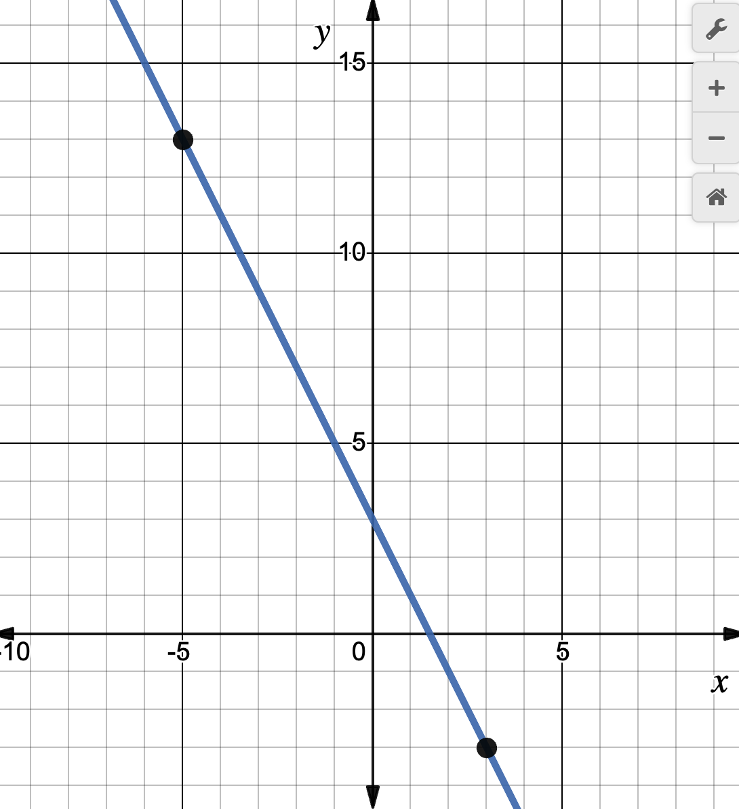

## Polynomials
Polynomials are mathematical objects which can be represented in multiple ways. They can be either univariate or multivariate, I will focus on the former. A (univariate) polynomial \\( A \\) in \\( x \\) over a field \\( \mathbb{F}_p \\) is defined as:

$$
A(x) = \sum_{j=0}^{n-1} a_jx^j
$$

If we expand the formula above for \\( n=3 \\), we get its equivalent:
$$
A(x) = a_0x^0 + a_1x^1 + a_2x^2 = a_0 + a_1x + a_2x^2
$$

The values \\(a_0, a_1, ...,a_{n-1}\\) are called coefficients. Non-zero coefficients are also known as *terms* or *monomials*. The *polynomial degree* is defined by the highest monomial degree. The parameter \\(n\\) defines the *order* (aka degree-bound) of the polynomial, it is equal to the number of coefficients in the expression. The order is strictly larger than the polynomial degree \\(k\\), so you can always assume \\(n \geq k+1\\). In the example above, the order of \\(A(x)\\) is 3 and its degree is 2. 

We can add, multiply, and divide polynomials, but some of these operations are very costly to be performed using the representation we are working with. Polynomials are usually represented in two equivalent ways: point-value and coefficient representation. Each of which has its own benefits.

### Coefficient representation
You are already familiar with this representation, it is the one introduced above. Let's revisit it, here's the coefficient form of a polynomial of order \\(n \\):
$$
A(x) = a_0 + a_1x + a_2x^2 + ... + a_{n-1}x^{n-1}
$$

When representing this form in software we don't actually need to store all the \\(x\\)'s. It would be a waste of space and computation. We can simply represent it using a vector of its coefficients, such as \\( [a_0, a_1, a_2, ... , a_{n-1}] \\). For example, the following polynomial \\(B \\):
$$
B = 5x^3 + 2x + 1
$$

Has coefficient representation given by the following vector:

$$
[1, 2, 0, 5]
$$

If the above sounds odd to you, take a moment to convince yourself before moving on. Tip: for convenience, the coefficient with largest degree is stored at the rightmost side of the array. 

### Point-value representation
We can also represent polynomials using a set of \\( n \\) point-value pairs over a field \\( \mathbb{F}_p \\). Polynomials have an infinite number of distinct point-values (aka (x, y), (domain, image), or (domain, value), etc) pairs, but you just need \\(n \\) of such pairs to be able to uniquely characterize them.

Remember the equation of a line that you learned in high school? Here it goes:
$$
y = mx + b
$$
As you can see, the line equation is a polynomial of order 2 (as any linear equation should be). Using the slope formula, you can easily get from point-value representation to the polynomial above. For example, the following points:

$$
x=-5,\ y=13 
\\\
x=3,\ y=-3
$$

Represent the linear equation
$$
y = -2x + 3
$$

The line intercepts both of points, as depicted in the image below:

The following vector \\(S \\) contains \\( n \\) point-value pairs, such that every \\(x_i \\) is distinct. \\(S \\) is the point-value representation of the polynomial \\( A \\) of order \\( n \\) and degree \\( n-1 \\):
$$
S = [ (x_0,y_0), (x_1,y_1),...,(x_{n-1},y_{n-1}) ],\ \text{where } y_k=A(x_k)
$$

### Polynomial evaluation
We use the polynomial evaluation method when we have the coefficient representation of a polynomial and want to get its point-value representation. There are many algorithms available for polynomial evaluation. The naïve way of doing it is to fix \\( n \\) distinct points \\(x_0, x_1, ..., x_{n-1} \\) and for each of these points calculate \\( A(x_i) \\) over the finite field \\( \mathbb{F}_p \\). This method has \\( \mathcal{O}(n^2) \\) time complexity. To illustrate it, consider that we will be working with the polynomial from our former example: \\(B = 5x^3 + 2x + 1\\). If \\(B \\) is defined over the finite field \\( \mathbb{F}_p \\) with \\( p=7\\) and we evaluate it at the points \\( x=[0, 1, 2, 3] \\) we will get \\( y=[1, 1, 3, 2] \\) (not \\( [1, 8, 45, 142] \\) because the size of the field is \\(7\\)).

### Polynomial interpolation
Polynomial interpolation is the opposite of polynomial evaluation. We use interpolation when we have the point-value representation but need its coefficient representation. This process is somewhat more complex than polynomial evaluation, but many interpolation methods are available. Lagrange interpolation is a popular choice, but just like its naïve counter-part above, it also has \\( \mathcal{O}(n^2) \\) runtime. To exemplify it, consider the points \\( x=[0, 1, 2, 3] \\) and evaluations \\( y=[1, 1, 3, 2] \\) calculated in the example above. [Using Lagrange interpolation](https://youtu.be/F5pJG4YfQxs), we can recover the coefficients \\( [1, 2, 0, 5] \\) that define the original polynomial \\(B = 5x^3 + 2x + 1\\).

The \\( \mathcal{O}(n^2) \\) runtime in both examples isn't great. The larger the polynomial, the slower it will be to perform such operations, but there is an alternative: FFTs can help us do both operations much faster!

## FFT
The Fast Fourier Transform (FFT) is a ubiquitous algorithm, powering applications from smartphone audio processing and Wi-Fi transmissions to advanced medical imaging and deep-space communication. Its impact is so profound that it's often hailed as [one of the most important algorithms of all time](https://youtu.be/nmgFG7PUHfo). A remarkable utility of the FFT lies in its ability to rapidly multiply large polynomials, and by extension, large numbers as well. While the traditional approach to polynomial multiplication has \\(O(n^2)\\) time complexity, the FFT accomplishes the same feat in just \\(O(n \log n)\\)!

Beyond multiplication, FFTs are instrumental in polynomial evaluation and interpolation, achieving both in \\(O(n \log n)\\) time, a large improvement from the methods I previously introduced. While evaluation utilizes the standard FFT, interpolation calls for its counterpart, the inverse FFT.

Nevertheless, the FFT isn't a silver bullet that can be used everywhere, it comes with specific prerequisites. With an FFT you can only interpolate and evaluate polynomials in finite fields (or with some special complex numbers) with domains that are multiplicative subgroups of such fields. You can think of a multiplicative subgroup as a set of elements that is "generated" from all the powers of some value, \\(V\\). For instance, take the finite field of integers modulo \\(491\\) and consider the domain \\(\\{1, 138, 386, 240, 223, 332, 153\\} \\) with \\(V=138\\), the expression \\( \\{ 138^i \bmod 491 \mid i \in \mathbb{N} \\} \\) can be used to check that this is the multiplicative subgroup of the finite field. You will start re-generating elements that are already in the set when you reach \\( i=7\\). Because of the FFT's recursive structure, the size of the multiplicative subgroup is often constrained to be \\(2^n \\), where \\( n\\) defines the order of the polynomial.

The FFT is normally taught in graduate level computer science courses to explain divide-and-conquer algorithm designs. It is challenging to master all of its inner concepts, but I believe the brief introduction I gave here will be enough to get you covered for the remainder of this blog post. If you're interested in learning more, here are some more thorough explanations:
- [Vitalik's blog](https://vitalik.ca/general/2019/05/12/fft.html)
- [Introduction to FFTs](https://youtu.be/h7apO7q16V0) (with nice graphs and visual effects).
- [Divide & Conquer: FFT, MIT's class   ](https://youtu.be/iTMn0Kt18tg)